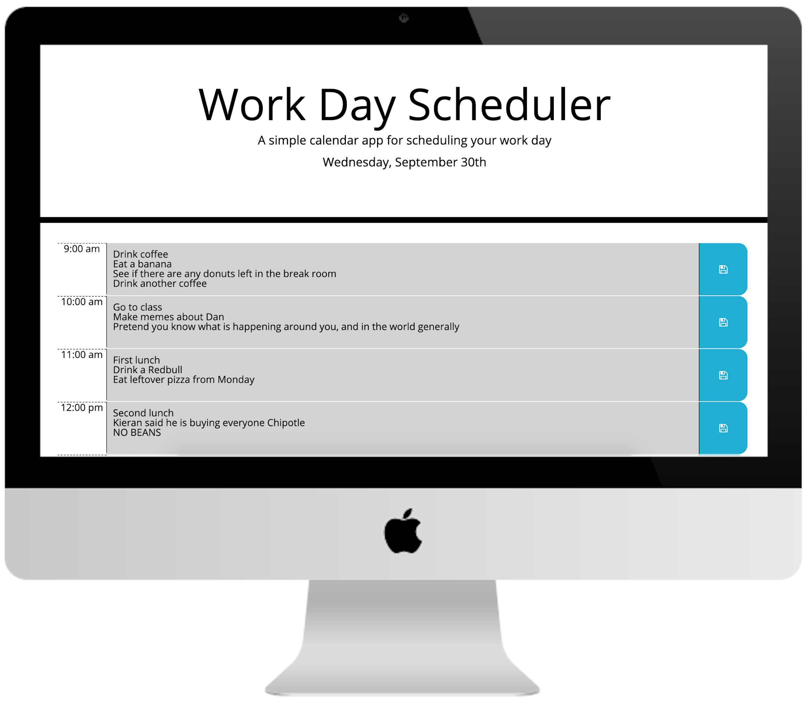

# Work day planner

## About this project
The purpose of this project was to create a work day planner. The application allows the user to enter text into hourly timeblocks which they can chose to save. If text is saved, it will be re-populated upon reloading the page. As the day progresses, the styling of the hourly blocks will change styles to idicate if the time block is in the past, present, or future. The application also displays the current date near the top of the page.

## Deployed link
https://josh8903.github.io/05-work-day-planner/

## Key implementations
* jQuery
* Moment.js
* Local storage

## Future development
* Add clear and save all feature
* Add time display to date
* Add feature to alter start and end times
* Add feature to change time block incrementation 
* Add a dynamic element to visually indicate current time by minute
* Add feature to save button to indicate if current text field is saved

- - -
Josh Thorngren
